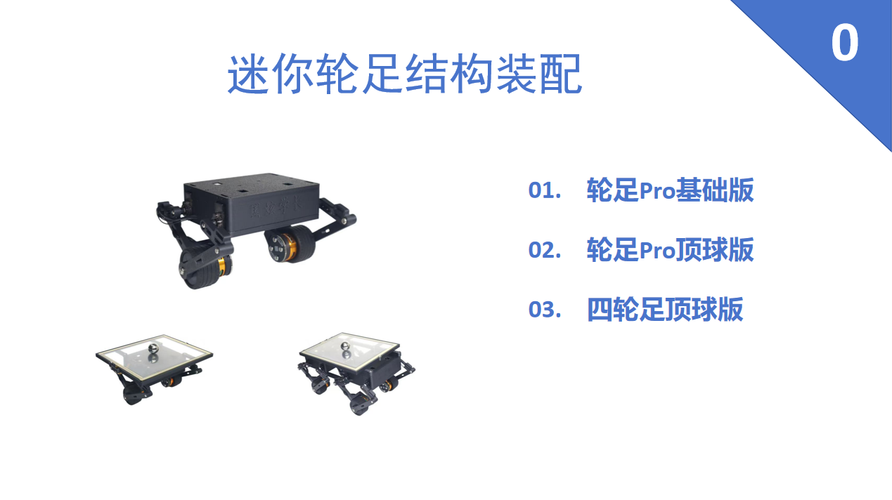

# Mini Wheeled-Leg Robot

### Introduction

The Mini Wheeled-Leg Robot is designed for robotics control algorithm enthusiasts. This platform allows users to practice advanced algorithms such as PID, LQR controllers, and Kalman filters, making it an excellent tool for exploring the field of robotics control.

Whether you're learning inverse kinematics, FOC motor drive techniques, or delving into other control methods, this platform provides hands-on experience that bridges theory and practical application.

Equipped with the ESP32S3 module, it features built-in WiFi and Bluetooth capabilities. This not only enables remote control, data transmission, and multi-robot collaboration, but also opens up limitless possibilities for creative development.

To ensure development flexibility, the robot uses the Arduino IDE, which offers a simple interface, abundant libraries, and user-friendly logic. This significantly lowers the entry barrier, making it easy for beginners to get started and quickly complete debugging.

Even if you're a complete novice, you can begin development with ease.

> Technical discussion group (QQ): 1034018990  
> [Demo Video](http://www.bilibili.com/video/BV1WQ5bz3ESg/?spm_id_from=333.337.search-card.all.click)  
> [Product & Parts Purchase](http://e.tb.cn/h.68HahNZxbi3Mf0G?tk=JHHiVc9SxGo)

### Software Architecture

Details coming soon...

### Installation Guide

1. [Assembly Video](https://www.bilibili.com/video/BV1EwLizQEqM/?spm_id_from=333.1387.homepage.video_card.click&vd_source=0521e93748b5b09affb73930c5d67d67)  
   

### Usage Instructions

1. Coming soon...

### Contributing

1. Coming soon...
