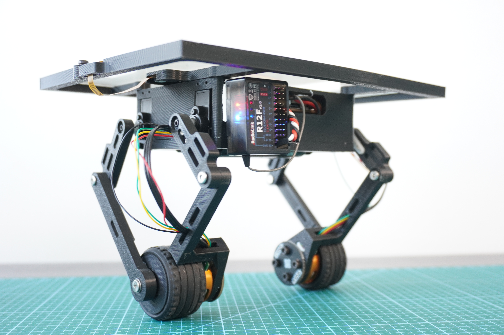

# Navbot-ES02 - Open Source Desktop Dual-Wheel Legged Robot



**Navbot-ES02** is a compact, open-source desktop robot that combines self-balancing wheels with articulated legs. It’s an experimental platform for exploring locomotion, balance, and user interaction — ideal for makers, educators, and robotics enthusiasts.

Full tutorial: [Frank Fu’s Build Guide](https://frankfu.blog/embodied-ai-robot/diy-desktop-dual-wheel-legged-roboy/)

---

##  Key Features

-  **Self-balancing** using MPU6050 and PID control
-  **Legged motion** using 270° digital servos
-  **Touchscreen interface** for motion control to achieve  ball-balancing
-  **Radiolink T12D RC System** for real-time operation switching via PWM/SBUS.
-  **Modular Arduino-based firmware** for easy customization

---

## Hardware Overview

| Component      | Description                                   |
|----------------|-----------------------------------------------|
| **MCU**        | ESP32-S3 DevKit                               |
| **Motors**     |  2208 90KV 3mm Shaft Gimbal Brushless Motors            |
| **IMU**        |  ICM42688 a 3-axis gyroscope and a 3-axis accelerometer            |
| **Servos**     | Pro-Tronik PTK 7452 MG-D 2.8kg/0.11s 12.3g Micro Digital Servo     |
| **HMI**        | 2.8" resistive/capacitive touchscreen         |
| **Battery**    | 2Pcs 18650 Battery Charger Pack              |
| **Controller**    | Radiolink T12D 12CH 2.4G RC Transmitter R12F Receiver                     |

---


## 📦 Software Structure

```
Navbot-ES02/
├── OllieFOCdrive/     # Motor & balance control
├── TouchUI/           # Touchscreen-based user interface
├── WiFiControl/       # Optional WebSocket/HTML control panel
├── partitions.csv     # Flash partition layout
└── lib/               # Required Arduino libraries
```

---

## Getting Started

### 1. Install Requirements

- Arduino IDE 2.x
- ESP32 board package (`esp32@3.0.7`)
- Libraries (via Library Manager or GitHub):
  - [SimpleFOC](https://github.com/simplefoc/Arduino-FOC)
  - [SimpleFOcDrivers](https://github.com/simplefoc/Arduino-FOC-drivers)
  - [Preferences](https://github.com/vshymanskyy/Preferences)
    
### 2. Flash the Firmware

```bash
git clone https://github.com/fuwei007/Navbot-ES02.git
```

- Open `OllieFOCdrive.ino` with Arduino IDE
- Select board: `ESP32S3 Dev Module`
- Upload code and monitor via Serial for debugging

---

## Tourial Videos

- DIY ES02 Desktop dual-wheel legged bot Preview:
  
  [](https://www.youtube.com/watch?v=u7Jmyq_AXwc)


- Open Source ESP32 DIY Robot ES02: Learn Coding & Robotics | Educational Dual-Wheel Legged Bot:
  [](https://www.youtube.com/watch?v=hujr_VRSyrw)

---

## Discord link
| Link: [https://discord.gg/syywQ2CKN3](https://discord.gg/syywQ2CKN3)        |
| :------------: |
|  |

---

## Acknowledgments

- [SimpleFOC Community](https://simplefoc.com/)
- [Frank Fu’s Robotics Blog](https://frankfu.blog)
- [LVGL GUI Library](https://lvgl.io/)
- Arduino & ESP32 Open Source Communities

---

> Feel free to fork, contribute, or build your own version!  
> PRs and feedback are always welcome.
